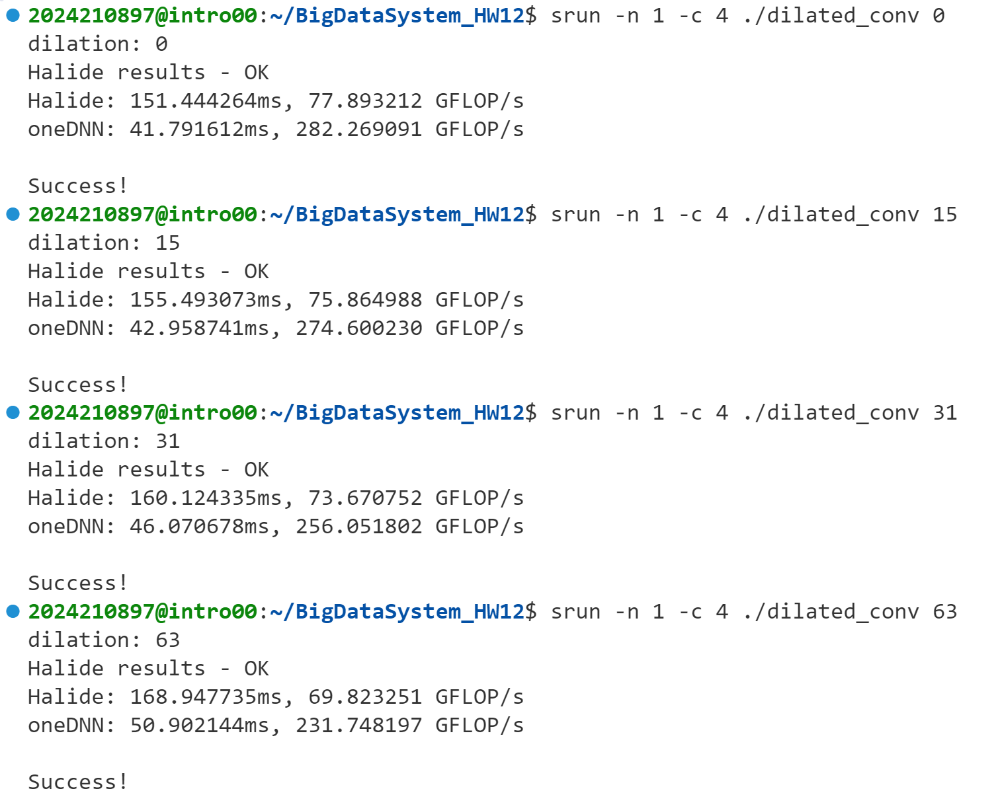
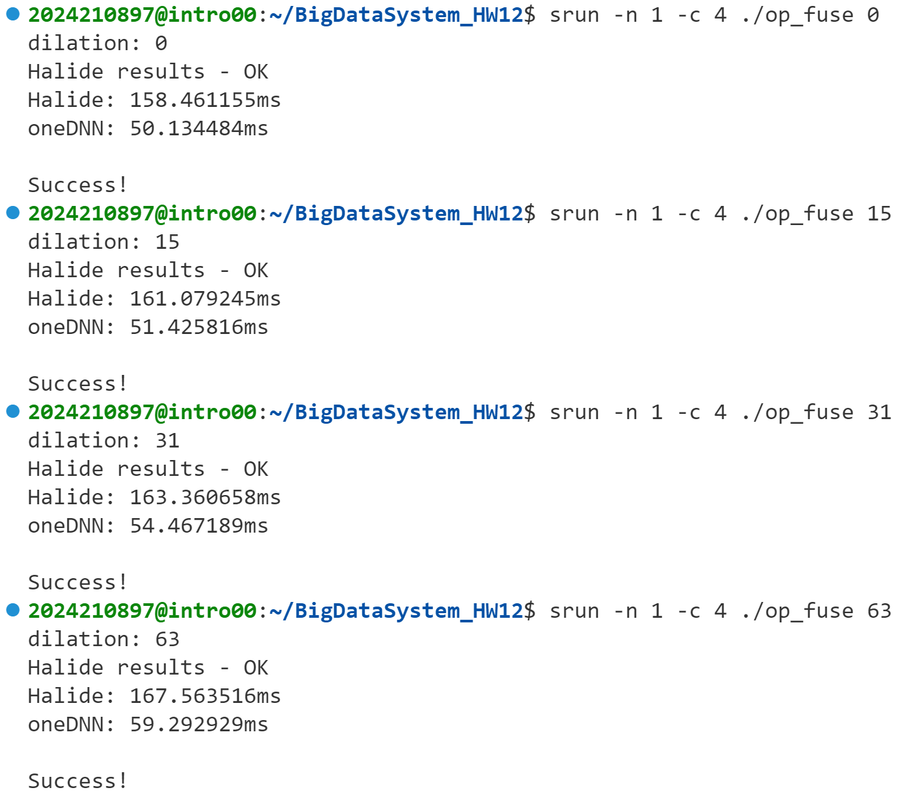

# HW12 Report
## Dilated Convolution Optimization
#### **主要优化逻辑**
优化主要分为以下几个部分：

##### **a. 输出函数 `out` 的调度**
   - **分块计算（`split`）**:
     将 `c` 和 `x` 维度分块，块大小分别为 `vec * tile_w` 和 `tile_h`，可以减少单次计算的数据量并为后续向量化和并行化铺平道路。
   - **重排计算顺序（`reorder`）**:
     调整计算维度的执行顺序为：`ci, xi, xo, y, n, co`。这种重排将局部计算放在一起，利用缓存更高效地处理数据。
   - **向量化（`vectorize`）**:
     对 `ci` 维度进行向量化，向量宽度为目标设备的自然向量大小（`vec`），利用 SIMD 指令提高并行计算性能。
   - **展开循环（`unroll`）**:
     对 `ci` 和 `xi` 进行展开，可减少循环开销，提升性能。
   - **多维并行化（`parallel`）**:
     并行化输出维度 `y, n, co`，充分利用多核 CPU 的计算能力。

##### **b. 中间函数 `dilated_conv` 的调度**
   - **局部计算内联（`compute_at`）**:
     将 `dilated_conv` 的计算内联到 `out` 的 `xo` 块中，以减少中间数据写入内存的次数。
   - **向量化与展开**:
     - 在 `c` 维度向量化，减少标量操作。
     - 展开小范围循环（如 `c, x, y`），减少循环开销。
   - **归约重排（`reorder`）**:
     将 `c, x, y` 放在前面，与外层计算一致，提升内存访问的局部性和性能。
   - **展开归约维度**:
     对归约维度 `r.x` 展开（例如 `unroll(r.x, 2)`），可以并行计算，进一步提升性能。

##### **c. 数据预处理调度**
   - **卷积核 `filter` 的调度**:
     将 `filter` 的计算内联到 `dilated_conv` 的归约维度 `r.x` 中，减少中间存储和内存访问。
     - 向量化与展开（如 `vectorize(_0)` 和 `unroll(_0)`）减少标量操作。
   - **输入 `input` 的调度**:
     - 在 `x` 块中内联计算，减少内存访问。
     - 对 `input` 的通道维度 `_0` 展开，减少循环开销。

#### **优化目的**
优化的主要目的是提升计算性能，同时减小内存带宽占用和缓存失配的风险：

1. **向量化和展开**:
   - SIMD 指令集可以并行处理向量数据（如 AVX、NEON），向量化能够显著提升单指令的计算吞吐量。
   - 展开循环减少了循环控制开销，对小范围的循环尤为适用。

2. **多维并行化**:
   - 利用多核 CPU 并行处理独立数据块，充分发挥硬件性能。

3. **分块和内联计算**:
   - 减少中间数据存储，减轻内存带宽压力。
   - 提升数据局部性，充分利用缓存。

4. **归约优化**:
   - 展开和重排归约操作，避免了复杂归约计算中的数据竞争和非必要依赖。

5. **内存访问优化**:
   - 对输入和卷积核的计算和存储进行了调度，使得每次计算只加载需要的数据，减少了内存访问的频率。

#### **优化效果**
不同`dilation`下的性能对比（表格）：
| Dilation | Halide Time (ms) | Halide GFLOP/s | oneDNN Time (ms) | oneDNN GFLOP/s |
|----------|------------------|----------------|------------------|----------------|
| 0        | 151.444264       | 77.893212      | 41.791612        | 282.269091     |
| 15       | 155.493073       | 75.864988      | 42.958741        | 274.600230     |
| 31       | 160.124335       | 73.670752      | 46.070678        | 256.051802     |
| 63       | 168.947735       | 69.823251      | 50.902144        | 231.748197     |

实验截图如下：

## Operation Fusion Optimization
#### **主要优化逻辑**
##### **a. 输出函数 `out` 的调度**
   - **分块计算（`split`）**:
     对 `c` 和 `x` 维度进行分块，块大小分别为 `vec * tile_w` 和 `tile_h`，减少数据处理规模，便于后续向量化和并行化。
   - **计算重排（`reorder`）**:
     调整计算顺序为 `ci, xi, xo, y, n, co`，以提高缓存局部性。
   - **向量化（`vectorize`）**:
     针对 `ci` 维度进行向量化，充分利用 SIMD 指令集，提升单指令多数据的处理效率。
   - **循环展开（`unroll`）**:
     展开小范围循环（如 `ci` 和 `xi`），减少循环控制开销。
   - **并行化（`parallel`）**:
     并行化多个维度（`y, n, co`），提高多核 CPU 的资源利用率。

##### **b. 归一化步骤的调度**
   归一化部分主要包括 `mu`、`sigma` 和 `inv_sqrt` 的计算：
   - **`mu` 和 `inv_sqrt` 的调度**:
     - **局部计算（`compute_at`）**:
       将这些计算嵌套在 `out` 的 `co` 块中，减少中间数据的存储需求。
     - **向量化与展开**:
       对 `ci` 维度进行向量化并展开（如 `vectorize(ci, vec)` 和 `unroll(ci)`），加速标量运算。
     - **并行化**:
       并行化计算的 `co` 维度，提升效率。

##### **c. 中间函数 `tmp` 的调度**
   - **分块和向量化**:
     对 `c` 和 `x` 维度分块并向量化，保证局部性和 SIMD 指令利用。
   - **内联计算（`compute_at`）**:
     将 `tmp` 计算嵌套到输出函数 `out` 的 `co` 块，减少中间内存开销。

##### **d. 膨胀卷积 `dilated_conv` 的调度**
   - **局部计算（`compute_at`）**:
     将 `dilated_conv` 的计算嵌套到 `tmp` 的 `xo` 块，避免多余的数据传输。
   - **向量化与展开**:
     - 在 `c` 维度向量化。
     - 展开循环维度（如 `x, y` 和部分归约维度 `r.x`），减少循环开销。
   - **归约重排（`reorder`）**:
     调整归约顺序为 `c, x, y, r.x, r.y, r.z, n`，以提升内存访问的局部性。

##### **e. 数据预处理的调度**
   - **卷积核 `filter` 的调度**:
     - 在 `dilated_conv` 的 `r.x` 中内联卷积核计算，避免重复加载。
     - 向量化和展开卷积核维度（如 `vectorize(_0)` 和 `unroll(_0)`）。
   - **输入数据 `input` 的调度**:
     - 在 `dilated_conv` 的 `x` 块中内联输入计算。
     - 展开通道维度（`_0`），减少循环控制开销。

#### **优化效果**
不同`dilation`下的性能对比（表格）：
| Dilation | Halide Time (ms) | oneDNN Time (ms) |
|----------|------------------|------------------|
| 0        | 158.461155       | 50.134484        |
| 15       | 161.079245       | 51.425816        |
| 31       | 163.360658       | 54.467189        |
| 63       | 167.563516       | 59.292929        |

实验截图如下：

## 实验感受
框架让人有点难度，第一遍看很多操作不理解，但是读懂之后感觉还是很有意思的。但说实话我的系统结构学的不是特别好，所以仍旧有一些操作不太理解，只能先照抄`conv`的优化方法，在此基础上尝试的改动均为负面改动，很难受。
在优化`op_fuse`时，为了将`bn`层融入`dilated_conv`层，我尝试在计算方差时使用$E(X^2)-E(X)^2$的方法，但不太明白的是其计算结果与正确结果相差甚远；因此在不用该方法的情况下想不到怎样在不算出`dilated_conv`的结果的情况下计算方差，于是无法直接利用均值与方差修改`filter`权重进行融合，只能放弃这个方法，不修改算法部分。
更不能理解的是，为什么用相同的优化方式优化`dilated_conv`和`op_fuse`时，`op_fuse`的运行时间会与`dilated_conv`几乎相同，甚至不使用`srun`（在服务器上直接使用`./`运行时）会出现`op_fuse`的用时更短的情况，明明对每个位置的计算操作变得更多了，这是我相当不理解的地方。